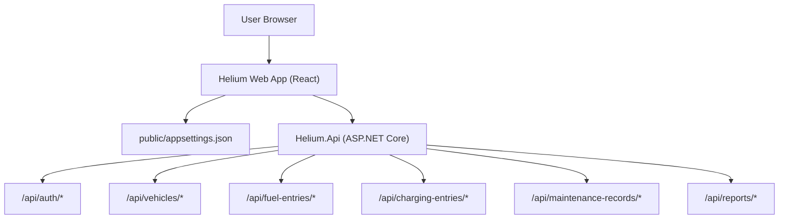

# Helium Frontend Web Application

This is the web frontend for the Helium application, built using **React**, **TypeScript**, and styled with **Tailwind CSS**.

## Architecture Overview



## Project Structure

- `src/`: Source code for the React application.
  - `index.tsx`: Entry point for the React application and backend health check.
  - `App.tsx`: Main application component that sets up routing (home, login, signup, etc.).
  - `pages/`: Page components for the application.
    - `HomePage.tsx`: Simple home page.
    - `LoginPage.tsx`: Login page that posts to `/api/auth/login`.
    - `SignupPage.tsx`: Registration page that posts to `/api/auth/register` and enforces password rules.
  - `components/`: Shared UI components used across pages.
  - `index.css`: Global CSS styles, including Tailwind CSS directives.

- `public/`: Static files.
  - `index.html`: Main HTML file for the React application.
  - `appsettings.json`: Frontend configuration file containing `apiBaseUrl` for the backend.

## Getting Started

To get started with the web application, follow these steps:

1. **Clone the repository**:
   ```
   git clone <repository-url>
   cd helium-frontend/web
   ```

2. **Install dependencies**:
  ```
  npm install
  ```

3. **Configure backend URL**:
  - Edit `public/appsettings.json` and set the `apiBaseUrl` to your backend URL, for example:
    ```
    {
     "apiBaseUrl": "http://localhost:10011"
    }
    ```

4. **Run the application**:
  ```
  npm start
  ```

The application will be available at `http://localhost:10015` and will call the backend using the `apiBaseUrl` from `appsettings.json`.

## Tailwind CSS

This project uses Tailwind CSS exclusively for styling. You can customize the styles in the `tailwind.config.js` file.

The forms (login and signup) use Tailwind utility classes for layout, typography, and interaction states.

## Authentication Flows

- **Signup**: Sends a POST request to `${apiBaseUrl}/api/auth/register` with `FirstName`, `LastName`, `Email`, `Password`, `PreferredCurrency`.
  - Enforces password rules: min 8 characters, at least one uppercase, one lowercase, one digit, and one special character.
  - Confirms password via a separate field.
- **Login**: Sends a POST request to `${apiBaseUrl}/api/auth/login` and expects a JWT token on success.

## Contributing

If you would like to contribute to this project, please fork the repository and submit a pull request. 

## License

This project is licensed under the MIT License. See the LICENSE file for details.