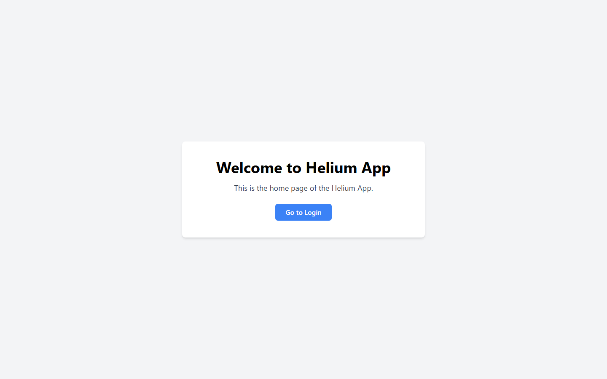
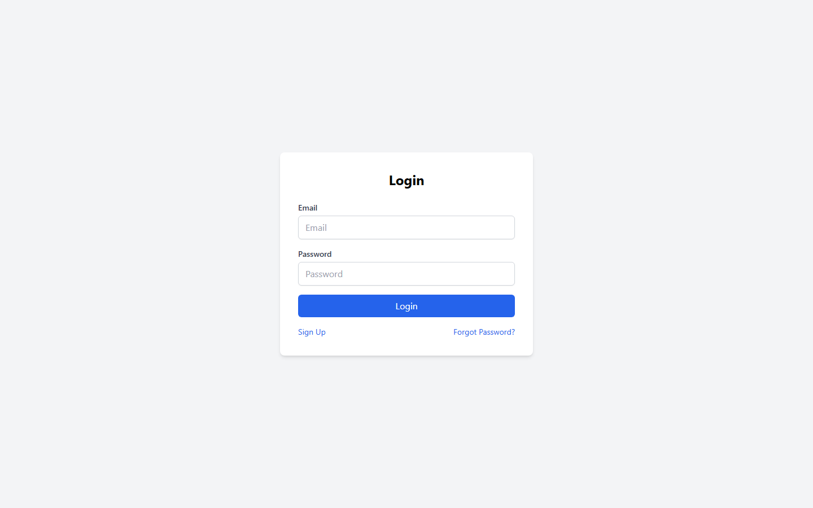
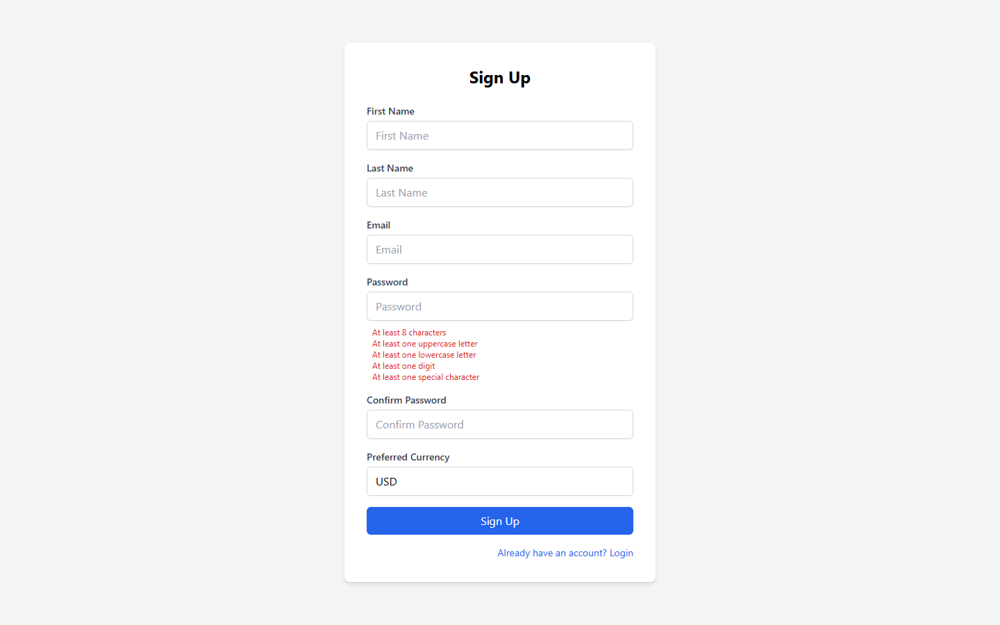
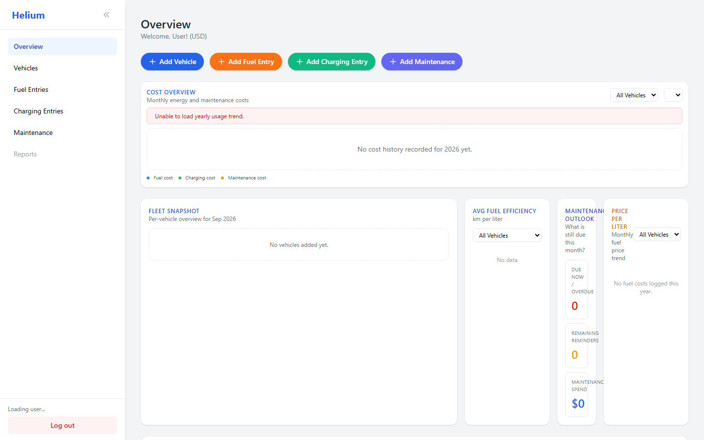
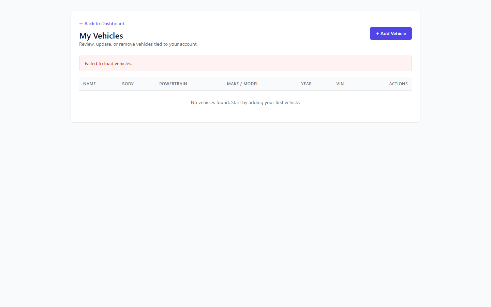
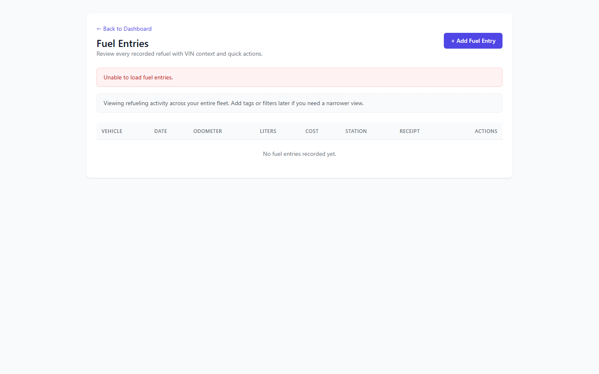
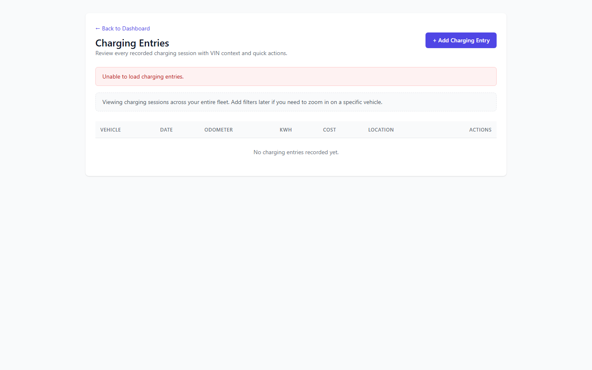
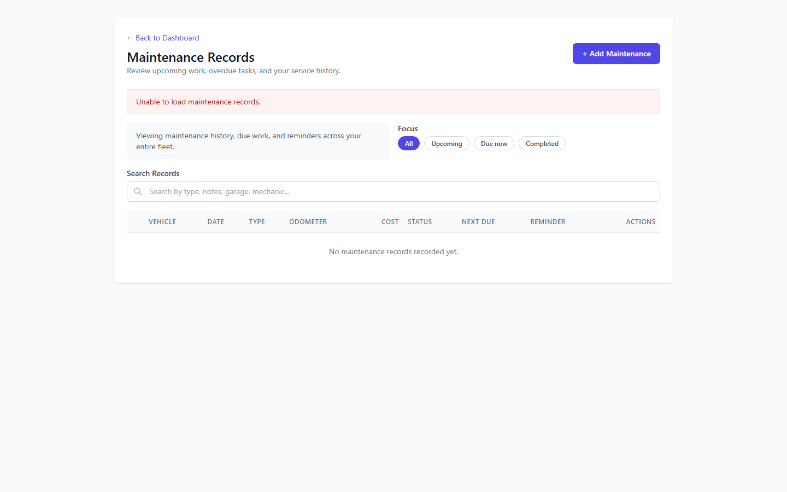

# Helium App

> **Helium** is a full-stack vehicle fleet management application for tracking fuel/charging entries, maintenance records, and fleet analytics. It provides per-vehicle efficiency metrics (km/L, km/kWh), cost breakdown dashboards with interactive SVG charts, maintenance reminder scheduling, and receipt management.

---

## Table of Contents

- [Features](#features)
- [Screenshots](#screenshots)
- [Tech Stack](#tech-stack)
- [Prerequisites](#prerequisites)
- [Installation](#installation)
  - [1. Clone the Repository](#1-clone-the-repository)
  - [2. Install Backend Dependencies](#2-install-backend-dependencies)
  - [3. Install Frontend npm Packages](#3-install-frontend-npm-packages)
- [Application Startup (IP & Ports)](#application-startup-ip--ports)
  - [Start the Backend API](#start-the-backend-api)
  - [Start the Frontend Web App](#start-the-frontend-web-app)
  - [One-Click Launcher](#one-click-launcher)
- [First-Time Login](#first-time-login)
- [Common Issues](#common-issues)
- [Documentation](#documentation)
  - [System Architecture Specification](#1-system-architecture-specification)
  - [Database Schema & Data Models Matrix](#2-database-schema--data-models-matrix)
  - [RESTful API Endpoint Reference](#3-restful-api-endpoint-reference)
  - [Business Logic Rules](#4-business-logic-rules)
  - [Project Structure](#5-project-structure)
  - [Known Gaps & Tech Debt](#6-known-gaps--tech-debt)
- [License](#license)

---

## Features

- **Vehicle Management** — CRUD for vehicles with make, model, year, powertrain type (Petrol/Diesel/Hybrid/Electric), body type, and VIN.
- **Fuel Entry Tracking** — Log fill-ups with odometer, liters, cost, station, and receipt.
- **Charging Entry Tracking** — Log EV charging sessions with kWh used, cost, and location.
- **Maintenance Records** — Track services with cost, garage, mechanic, work status, and optional reminders (mileage- or time-based).
- **Dashboard Analytics** — Cost overview SVG chart, fleet snapshot, average fuel efficiency, maintenance outlook, price per liter, and recent activity.
- **JWT Authentication** — Secure register/login with bearer token authorization.

---

## Screenshots

### Home Page



### Login Page



### Signup Page



### Dashboard



### Vehicles



### Fuel Entries



### Charging Entries



### Maintenance Records



---

## Tech Stack

| Layer | Technology |
| :--- | :--- |
| **Frontend** | React 17, TypeScript, Tailwind CSS 4, Axios, React Router v5 (CRA) |
| **Backend** | ASP.NET Core 10 (Clean Architecture: Domain → Application → Infrastructure → Api) |
| **Database** | SQL Server Express LocalDB (`HeliumAppDb`) via Entity Framework Core 10 |
| **Auth** | JWT Bearer (HMAC-SHA256, 120-min expiry) |
| **Validation** | FluentValidation |
| **Mapping** | AutoMapper |
| **Logging** | Serilog (console sink) |

---

## Prerequisites

Before installing, ensure you have the following installed on your machine:

- **[.NET 10 SDK](https://dotnet.microsoft.com/download)** — required to build and run the backend API.
- **[Node.js](https://nodejs.org/)** (with npm) — required to build and run the frontend web app.
- **[SQL Server Express LocalDB](https://learn.microsoft.com/en-us/sql/database-engine/configure-windows/sql-server-express-localdb)** (or full SQL Server) — required for the database.
- **AutoHotkey** *(optional)* — only needed for the one-click launcher script.

---

## Installation

### 1. Clone the Repository

```bash
git clone https://github.com/PandulaGo/TechTaa-Solutions-Helium.git
cd "Helium App"
```

### 2. Install Backend Dependencies

The backend uses .NET NuGet packages. Restore them with:

```bash
cd "Backend\Helium.Api"
dotnet restore
```

This restores all NuGet packages across the solution, including:

| Project | Key Packages |
| :--- | :--- |
| **Helium.Api** | `Microsoft.AspNetCore.Authentication.JwtBearer` 10.0.2, `FluentValidation.AspNetCore` 11.3.1, `Microsoft.EntityFrameworkCore.Design` 10.0.2, `Serilog.AspNetCore` 8.0.2, `Serilog.Sinks.Console` 5.0.1 |
| **Helium.Application** | `AutoMapper` 14.0.0, `FluentValidation` 11.11.0, `FluentValidation.DependencyInjectionExtensions` 11.11.0, `Microsoft.EntityFrameworkCore` 10.0.2 |
| **Helium.Infrastructure** | `Microsoft.EntityFrameworkCore.SqlServer` 10.0.2, `System.IdentityModel.Tokens.Jwt` 8.6.0, EF Core Design + Configuration extensions |

### 3. Install Frontend npm Packages

The frontend is a React app managed with npm. Install all dependencies with:

```bash
cd "Frontend\helium-frontend\web"
npm install
```

This installs the following npm packages (from `package.json`):

| Package | Version | Purpose |
| :--- | :--- | :--- |
| `react` / `react-dom` | ^17.0.2 | UI framework |
| `react-router-dom` | ^5.3.0 | Client-side routing |
| `axios` | ^1.13.5 | HTTP client for API calls |
| `tailwindcss` | ^4.2.0 | Utility-first CSS |
| `autoprefixer` | ^10.4.24 | CSS vendor prefixing |
| `postcss` | ^8.5.6 | CSS processing |
| `react-scripts` | ^0.0.0 | CRA build toolchain |
| `cross-env` | ^10.1.0 | Cross-platform env vars (dev) |
| `@types/react`, `@types/react-dom`, `@types/react-router-dom` | ^17.x | TypeScript type definitions (dev) |

---

## Application Startup (IP & Ports)

The application runs on the following local addresses:

| Service | HTTP | HTTPS | Purpose |
| :--- | :--- | :--- | :--- |
| **Backend API** | `http://localhost:10011` | `https://localhost:10012` | REST API + Swagger/health |
| **Frontend Web** | `http://localhost:10015` | — | React web application |

> **Note:** The frontend CORS policy only allows `http://localhost:10015`. The frontend must run on this exact origin.

### Start the Backend API

```bash
cd "Backend\Helium.Api"
dotnet run
```

- Starts on `http://localhost:10011` (HTTP) and `https://localhost:10012` (HTTPS).
- On startup, `Program.cs` **automatically applies database migrations**, creating the `HeliumAppDb` database if it does not exist.
- Verify it is running by visiting `http://localhost:10011/api/health` → returns `{ "status": "ok" }`.

### Start the Frontend Web App

```bash
cd "Frontend\helium-frontend\web"
npm start
```

- Starts on `http://localhost:10015`.
- The start script automatically sets `PORT=10015` and `NODE_OPTIONS=--openssl-legacy-provider` (required for the legacy Webpack/OpenSSL combination).
- Open `http://localhost:10015` in your browser.

### One-Click Launcher

An AutoHotkey launcher script is provided at `F:\GitHub\Helium App\start-helium.ahk`:

- **Yes** → starts the backend (`dotnet run --project Helium.Api`) **and** the frontend (`npm start`).
- **No** → starts the frontend only.

---

## First-Time Login

- **No default admin user exists** on a fresh database.
- Register a new account via the **Signup** page (`http://localhost:10015/signup`).
- During development, the account `admin@helium.app` / `Admin@123` was used.

---

## Common Issues

| Issue | Solution |
| :--- | :--- |
| **CORS errors** | Ensure the frontend runs on `http://localhost:10015` (the only allowed origin). |
| **Port conflicts** | Ensure ports `10011`, `10012`, and `10015` are free before starting. |
| **OpenSSL legacy provider** | Required for the frontend build; do not remove `NODE_OPTIONS=--openssl-legacy-provider`. |
| **Database not created** | The backend auto-applies migrations on startup; ensure SQL Server LocalDB is installed and running. |

---

## Documentation

The full technical documentation is maintained in the [`docs/`](docs/) folder:

- [`docs/Architecture and Other Details.md`](docs/Architecture%20and%20Other%20Details.md) — System architecture, database schema, API reference, business logic, setup guide.
- [`docs/Context Ledger.md`](docs/Context%20Ledger.md) — Engineering sprint & session ledger, ADRs, roadmap.

The key sections are reproduced below for convenience.

---

### 1. System Architecture Specification

#### Executive Summary

- **Core Purpose:** Helium is a full-stack vehicle fleet management application for tracking fuel/charging entries, maintenance records, and fleet analytics. It provides per-vehicle efficiency metrics (km/L, km/kWh), cost breakdown dashboards with interactive SVG charts, maintenance reminder scheduling, and receipt management. Designed for personal or small-fleet use by individual vehicle owners.
- **Target Audience:** End-users (vehicle owners managing personal fleets of 1–N vehicles). Backend also serves potential mobile (Flutter) and third-party clients via a RESTful JWT-secured API.

#### Component Blueprint & Tech Stack

- **Frontend Layer:** React 17, TypeScript 4.x, Tailwind CSS 4.x, Axios HTTP client, React Router v5 (HashRouter). Create React App (CRA) build toolchain. No global state management library (local component state only). Collapsible sidebar layout with viewport-locked navigation. Vehicle-themed SVG favicon (`public/favicon.svg`).
- **Backend/API Layer:** ASP.NET Core 10.0 Web API (Clean Architecture with 4 layers: Domain → Application → Infrastructure → Api). JWT Bearer authentication (HMAC-SHA256, 120-minute expiry). FluentValidation auto-validation. AutoMapper for entity↔DTO mapping. Serilog structured console logging. Global exception middleware. Background service (`MaintenanceReminderBackgroundService`) runs every 6 hours. CORS policy allows `http://localhost:10015` only.
- **Data Persistence Layer:** Entity Framework Core 10.x with SQL Server Express LocalDB (`HeliumAppDb`). `AppDbContext` with `GenericRepository<T>` + `UnitOfWork` pattern. Single migration (`20260502044911_InitialCreate`). Local file storage for receipt images (`LocalFileStorageService` → `storage/` directory).
- **External Integrations:** None currently active. NotificationService is a log-only stub. Planned: Gmail SMTP (MailKit) for PIN-based passwordless login (ADR-015, design approved, not implemented). Mobile Flutter app scaffolded but empty.

#### Data Flow & Communication Lifecycle

1. **Authentication Flow:**
   `Frontend LoginPage → POST /api/auth/login (email + password) → AuthController.Login() → AuthService.LoginAsync() → UserRepo.Query(email) → PasswordHasher.Verify(salt+password) → JwtTokenService.GenerateToken(sub, email) → return AuthResultDto{token, user} → Frontend stores JWT in localStorage → redirects to /dashboard`

2. **Core Feature Read/Write Flow (Fuel Entry example):**
   `Frontend FuelEntryCreatePage → POST /api/fuelentries (JWT + body) → FuelEntriesController.Create() → FuelEntryService.CreateAsync() → validate VehicleId ownership → FluentValidation → Repository.AddAsync() → UnitOfWork.SaveChangesAsync() → return 201 Created`

---

### 2. Database Schema & Data Models Matrix

#### Entity: User

| Attribute Name | Storage Data Type | Key / Modifiers | Logical Field Description |
| :--- | :--- | :--- | :--- |
| `Id` | `Guid` | Primary Key / UUID | Unique auto-generated entity identifier |
| `FirstName` | `nvarchar(100)` | Not Null | User's first name |
| `LastName` | `nvarchar(100)` | Not Null | User's last name |
| `Email` | `nvarchar(200)` | Not Null / Unique Index | Primary user authentication identifier |
| `PasswordHash` | `nvarchar(max)` | Not Null | SHA256 hash of password + salt |
| `PasswordSalt` | `nvarchar(max)` | Not Null | 16-byte random salt (Base64) |
| `PreferredCurrency` | `nvarchar(10)` | Default: `"USD"` | ISO currency code for cost display |
| `CreatedAt` | `DateTimeOffset` | Default: NOW() | Audit timestamp (from EntityBase) |
| `UpdatedAt` | `DateTimeOffset?` | Nullable | Audit timestamp (from EntityBase) |

#### Entity: Vehicle

| Attribute Name | Storage Data Type | Key / Modifiers | Logical Field Description |
| :--- | :--- | :--- | :--- |
| `Id` | `Guid` | Primary Key / UUID | Unique identifier |
| `UserId` | `Guid` | Foreign Key → `User.Id` | Owner of the vehicle (cascade delete) |
| `Name` | `nvarchar(100)` | Not Null | User-assigned display name |
| `Make` | `nvarchar(100)` | Not Null | Manufacturer |
| `Model` | `nvarchar(100)` | Not Null | Model name |
| `Year` | `int?` | Nullable | Manufacturing year |
| `PowertrainType` | `int` | Not Null / Enum | 0=Petrol, 1=Diesel, 2=Hybrid, 3=Electric |
| `BodyType` | `int` | Not Null / Enum | 0=Sedan, 1=SUV, 2=Truck, 3=Hatchback, 4=Coupe, 5=Wagon, 6=Van, 7=Convertible |
| `Vin` | `nvarchar(50)` | Nullable | Vehicle Identification Number |

#### Entity: FuelEntry

| Attribute Name | Storage Data Type | Key / Modifiers | Logical Field Description |
| :--- | :--- | :--- | :--- |
| `Id` | `Guid` | Primary Key / UUID | Unique identifier |
| `UserId` | `Guid` | Foreign Key → `User.Id` | Creator (NoAction delete) |
| `VehicleId` | `Guid` | Foreign Key → `Vehicle.Id` | Associated vehicle (cascade delete) |
| `Date` | `DateTimeOffset` | Not Null | Date/time of fill-up |
| `Odometer` | `int` | Not Null | Odometer reading in km |
| `Liters` | `decimal(18,2)` | Not Null / Positive | Fuel volume in liters |
| `Cost` | `decimal(18,2)` | Not Null / Positive | Total cost |
| `Station` | `nvarchar(200)` | Nullable | Fuel station name |
| `ReceiptImagePath` | `nvarchar(max)` | Nullable | Receipt image file path |

#### Entity: ChargingEntry

| Attribute Name | Storage Data Type | Key / Modifiers | Logical Field Description |
| :--- | :--- | :--- | :--- |
| `Id` | `Guid` | Primary Key / UUID | Unique identifier |
| `UserId` | `Guid` | Foreign Key → `User.Id` | Creator (NoAction delete) |
| `VehicleId` | `Guid` | Foreign Key → `Vehicle.Id` | Associated vehicle (cascade delete) |
| `Date` | `DateTimeOffset` | Not Null | Date/time of charging session |
| `Odometer` | `int` | Not Null | Odometer reading in km |
| `KwhUsed` | `decimal(18,2)` | Not Null / Positive | Energy consumed in kWh |
| `Cost` | `decimal(18,2)` | Not Null / Positive | Total cost |
| `Location` | `nvarchar(200)` | Nullable | Charging station location |

#### Entity: MaintenanceRecord

| Attribute Name | Storage Data Type | Key / Modifiers | Logical Field Description |
| :--- | :--- | :--- | :--- |
| `Id` | `Guid` | Primary Key / UUID | Unique identifier |
| `UserId` | `Guid` | Foreign Key → `User.Id` | Creator (NoAction delete) |
| `VehicleId` | `Guid` | Foreign Key → `Vehicle.Id` | Associated vehicle (cascade delete) |
| `Type` | `nvarchar(200)` | Not Null | Maintenance type description |
| `Odometer` | `int` | Not Null | Odometer reading in km |
| `ServiceDate` | `DateTimeOffset` | Not Null | Date service performed |
| `Notes` | `nvarchar(max)` | Nullable | Free-text notes |
| `ReceiptImagePath` | `nvarchar(max)` | Nullable | Receipt image file path |
| `Cost` | `decimal(18,2)` | Not Null / Positive | Total cost |
| `Garage` | `nvarchar(200)` | Nullable | Garage/shop name |
| `Mechanic` | `nvarchar(200)` | Nullable | Mechanic name |
| `WorkStatus` | `int` | Not Null / Enum | 0=Scheduled, 1=InProgress, 2=Completed |

#### Entity: MaintenanceReminder

| Attribute Name | Storage Data Type | Key / Modifiers | Logical Field Description |
| :--- | :--- | :--- | :--- |
| `Id` | `Guid` | Primary Key / UUID | Unique identifier |
| `MaintenanceRecordId` | `Guid` | Foreign Key → `MaintenanceRecord.Id` / Unique | One-to-one with parent record (cascade delete) |
| `IntervalType` | `int` | Not Null / Enum | 0=Mileage, 1=Time |
| `IntervalValue` | `int` | Not Null | Mileage interval (km) or time interval (days) |
| `NextDueDate` | `DateTimeOffset?` | Nullable | Next due date (Time-based) |
| `NextDueMileageKm` | `int?` | Nullable | Next due odometer (Mileage-based) |

#### Entity Relationships

- **`User` → `Vehicle`**: One-to-Many. Deleting a user cascades delete to all vehicles.
- **`Vehicle` → `FuelEntry` / `ChargingEntry` / `MaintenanceRecord`**: One-to-Many. Deleting a vehicle cascades delete to all entries.
- **`MaintenanceRecord` → `MaintenanceReminder`**: One-to-One (unique FK). Deleting a record cascades delete to its reminder.
- **`FuelEntry` / `ChargingEntry` / `MaintenanceRecord` → `User`**: Foreign Key with NoAction delete behavior.

---

### 3. RESTful API Endpoint Reference

**Service Context & Global Defaults:**
- **Local Base Path:** `http://localhost:10011`
- **HTTPS Base Path:** `https://localhost:10012`
- **Global Headers:** `Content-Type: application/json`, `Authorization: Bearer <token>` (protected endpoints)
- **Error Format:** RFC 7807 `ProblemDetails`

#### Auth (Public)

| Method | Endpoint | Description |
| :--- | :--- | :--- |
| `POST` | `/api/auth/register` | Register a new user → `{token, user}` |
| `POST` | `/api/auth/login` | Login → `{token, user}` |

#### Users

| Method | Endpoint | Description |
| :--- | :--- | :--- |
| `GET` | `/api/users/me` | Get current user profile |

#### Vehicles

| Method | Endpoint | Description |
| :--- | :--- | :--- |
| `GET` | `/api/vehicles` | List vehicles (paginated) |
| `GET` | `/api/vehicles/{id}` | Get vehicle by ID |
| `POST` | `/api/vehicles` | Create vehicle (201) |
| `PUT` | `/api/vehicles/{id}` | Update vehicle (204) |
| `DELETE` | `/api/vehicles/{id}` | Delete vehicle (204) |

#### Fuel Entries

| Method | Endpoint | Description |
| :--- | :--- | :--- |
| `GET` | `/api/fuelentries?vehicleId=` | List fuel entries (paginated) |
| `GET` | `/api/fuelentries/{id}` | Get fuel entry by ID |
| `POST` | `/api/fuelentries` | Create fuel entry (201) |
| `PUT` | `/api/fuelentries/{id}` | Update fuel entry (204) |
| `DELETE` | `/api/fuelentries/{id}` | Delete fuel entry (204) |

#### Charging Entries

| Method | Endpoint | Description |
| :--- | :--- | :--- |
| `GET` | `/api/chargingentries?vehicleId=` | List charging entries (paginated) |
| `GET` | `/api/chargingentries/{id}` | Get charging entry by ID |
| `POST` | `/api/chargingentries` | Create charging entry (201) |
| `PUT` | `/api/chargingentries/{id}` | Update charging entry (204) |
| `DELETE` | `/api/chargingentries/{id}` | Delete charging entry (204) |

#### Maintenance Records

| Method | Endpoint | Description |
| :--- | :--- | :--- |
| `GET` | `/api/maintenancerecords?vehicleId=` | List maintenance records (paginated) |
| `GET` | `/api/maintenancerecords/due` | Get due maintenance records |
| `GET` | `/api/maintenancerecords/{id}` | Get maintenance record by ID |
| `POST` | `/api/maintenancerecords` | Create maintenance record (201) |
| `PUT` | `/api/maintenancerecords/{id}` | Update maintenance record (204) |
| `DELETE` | `/api/maintenancerecords/{id}` | Delete maintenance record (204) |

#### Dashboard (all `[Authorize]`)

| Method | Endpoint | Description |
| :--- | :--- | :--- |
| `GET` | `/api/dashboard/summary?month=` | Dashboard summary |
| `GET` | `/api/dashboard/energy-trend?year=&vehicleId=` | Yearly energy trend (12 points) |
| `GET` | `/api/dashboard/available-years` | Available years (descending) |
| `GET` | `/api/dashboard/vehicles?month=` | Vehicle summaries |
| `GET` | `/api/dashboard/recent-activity?count=` | Recent activity (default 10) |

#### Reports / Files / Health

| Method | Endpoint | Description |
| :--- | :--- | :--- |
| `GET` | `/api/reports/vehicle-efficiency/{vehicleId}` | Vehicle efficiency report |
| `POST` | `/api/files/receipts` | Upload receipt image (multipart, 10 MB) |
| `GET` | `/api/health` | Health check (public) → `{status: "ok"}` |
| `GET` | `/` | Root greeting (public) |

---

### 4. Business Logic Rules

#### Fuel/Charging Efficiency (km/L & km/kWh)
- Efficiency is computed as the **average of consecutive per-fill-up pairs**: `tripDist / tripLiters` for each adjacent pair of entries.
- Requires **≥2 entries** for a meaningful efficiency value.
- **Hybrid vehicles:** fuel distance uses only fuel-odometer pairs; charging distance uses only charging-odometer pairs.
- `costPerKm = totalCost / (maxOdometer - minOdometer)`.

#### Maintenance Reminder Due Logic
- **Time-based:** due when `NextDueDate <= asOfDate`.
- **Mileage-based:** due when `latestOdometer >= NextDueMileageKm` (latest odometer = max across all entries).
- **Background service** runs every 6 hours and forwards due reminders to `NotificationService` (currently a log-only stub).

#### Security & Auth
- **Password hashing:** SHA256 of UTF8 `password + salt`; salt = 16 random bytes (Base64).
- **JWT:** HMAC-SHA256, issuer `HeliumApp`, audience `HeliumAppUsers`, secret `CHANGE_ME_TO_A_SECURE_32_CHAR_SECRET`, expiry 120 minutes.
- All URLs lowercase (`LowercaseUrls=true`).

#### Error Handling
`ExceptionHandlingMiddleware` maps exceptions to RFC 7807 `ProblemDetails`:

| Exception | HTTP Status |
| :--- | :--- |
| `KeyNotFoundException` | 404 Not Found |
| `UnauthorizedAccessException` | 401 Unauthorized |
| `InvalidOperationException` | 400 Bad Request |
| Any other | 500 Internal Server Error |

---

### 5. Project Structure

```
Helium App/
├── Backend/
│   ├── Helium.Domain/            # Entities, enums, EntityBase (no deps)
│   ├── Helium.Application/       # DTOs, services, validators, AutoMapper, DI
│   ├── Helium.Infrastructure/    # AppDbContext, repositories, JWT, storage, notifications
│   ├── Helium.Api/               # Controllers, middleware, Program.cs
│   └── Helium.Api.Tests/         # Integration tests
├── Frontend/
│   └── helium-frontend/
│       └── web/                  # React 17 + TS + Tailwind (CRA)
│           ├── public/           # index.html, favicon.svg, appsettings.json
│           └── src/
│               ├── pages/        # Home, Login, Signup, Dashboard, Vehicles, Fuel, Charging, Maintenance
│               └── components/   # PrimaryButton, shared UI
├── docs/                         # Architecture and Other Details.md, Context Ledger.md
└── start-helium.ahk              # AutoHotkey launcher
```

---

### 6. Known Gaps & Tech Debt

| Area | Status | Notes |
| :--- | :--- | :--- |
| PIN-based passwordless login (ADR-015) | Design approved, **not implemented** | No MailKit, no PIN endpoints, no OnboardingPage. |
| NotificationService | Log-only stub | No real email delivery. |
| Route guard / auth context | Missing | Pages can be visited without a token. |
| Pagination controls | Missing on frontend | All pages hardcode pageSize 50/100/200. |
| Receipt upload | URL text field only | No file picker or download endpoint. |
| Password hashing | SHA256 + salt | Should migrate to BCrypt/Argon2 (ADR-004). |
| Axios interceptor | Missing | Every page reads `localStorage.getItem('token')` manually (ADR-006). |

---

## License

This project is a private/internal application. No license is specified.
