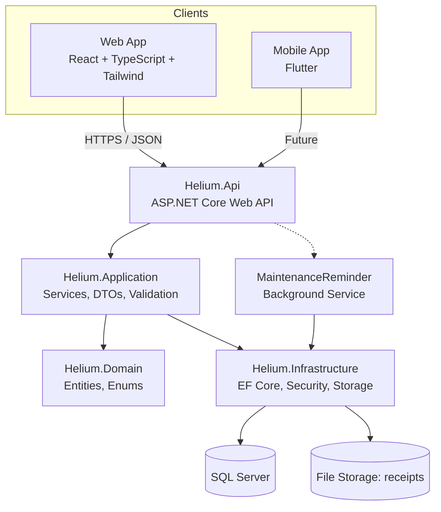
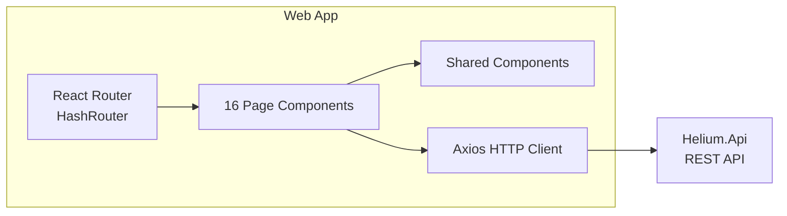

# System Architecture

## High-Level Architecture



## Layer Breakdown

### 1. Helium.Domain (Core)
The innermost layer with zero dependencies.

| Component | Contents |
|-----------|----------|
| Entities | `User`, `Vehicle`, `FuelEntry`, `ChargingEntry`, `MaintenanceRecord`, `MaintenanceReminder` |
| Enums | `PowertrainType` (Petrol/Diesel/Hybrid/Electric), `VehicleBodyType` (Car/Van/Bike/Truck/Suv), `ReminderIntervalType` (Mileage/Time) |
| Common | `EntityBase` — provides `Id`, `CreatedAt`, `UpdatedAt` to all entities |

### 2. Helium.Application (Use Cases)
Orchestrates business logic. Depends only on Domain.

| Component | Contents |
|-----------|----------|
| Interfaces | `IVehicleService`, `IFuelEntryService`, `IChargingEntryService`, `IMaintenanceService`, `IAuthService`, `IReportService`, `IDashboardService` |
| DTOs (Models) | Create/Update/Read DTOs for every entity + pagination models (`PaginationQuery`, `PagedResult<T>`, `SortDirection`) |
| Services | Full CRUD implementations + efficiency reports + dashboard summaries + yearly energy trends |
| Validation | FluentValidation validators for auth, vehicle, fuel/charging, maintenance |
| Mapping | AutoMapper profile (`ApplicationMappingProfile`) for entity-to-DTO mapping |

### 3. Helium.Infrastructure (Persistence & External Concerns)
Implements interfaces defined in Application. Depends on Application + Domain.

| Component | Contents |
|-----------|----------|
| Persistence | EF Core `AppDbContext`, `GenericRepository<T>`, `UnitOfWork`, EF Migrations |
| Security | `PasswordHasher` (SHA256 + salt), `JwtTokenService` (HMAC-SHA256), `JwtSettings` |
| Storage | `LocalFileStorageService` — save/get/delete receipt images on disk |
| Notifications | `NotificationService` — currently a logger placeholder |
| DI | `DependencyInjection` class for registering all infrastructure services |

### 4. Helium.Api (Presentation)
ASP.NET Core Web API. Depends on Application + Infrastructure.

| Component | Contents |
|-----------|----------|
| Controllers | `AuthController`, `VehiclesController`, `FuelEntriesController`, `ChargingEntriesController`, `MaintenanceRecordsController`, `ReportsController`, `DashboardController`, `FilesController` |
| Middleware | Global `ExceptionHandlingMiddleware` (404/401/400/500 mapping) |
| Background Services | `MaintenanceReminderBackgroundService` (runs every 6 hours) |
| Configuration | `appsettings.json` — connection string, JWT settings, Serilog |

## Frontend Architecture



### Web App (React 17 + TypeScript + Tailwind CSS)
- **Routing**: React Router v5 with `Switch` — 14 routes (home, login, signup, dashboard, 11 CRUD pages)
- **HTTP**: Axios with JWT Bearer token from localStorage
- **State**: Local component state (no Redux/Zustand)
- **Styling**: Tailwind CSS exclusively (Bootstrap removed)
- **Pages**: Home, Login, Signup, Dashboard, Vehicles (list/create/edit), Fuel Entries (list/create/edit), Charging Entries (list/create/edit), Maintenance Records (list/create/edit)

### Mobile App (Flutter)
- Scaffolded only — Android + iOS project files, `pubspec.yaml`, no application code yet
- Planned to consume same REST API

## Data Flow

```
User Action → React Page → Axios (JWT) → Helium.Api Controller
  → Application Service → Repository → EF Core → SQL Server
  → Response ← DTO ← Entity ←
```

## Tech Stack

| Layer | Technology | Version |
|-------|------------|---------|
| Backend Framework | ASP.NET Core | 8.0 |
| ORM | Entity Framework Core | 8.x |
| Database | SQL Server (LocalDB dev) | LocalDB |
| Auth | JWT (HMAC-SHA256) | Custom |
| Validation | FluentValidation | Latest |
| Mapping | AutoMapper | Latest |
| Logging | Serilog | Latest |
| Web Frontend | React | 17 |
| Web Language | TypeScript | 4.x |
| Styling | Tailwind CSS | 4.x |
| HTTP Client | Axios | 1.x |
| Mobile Frontend | Flutter | Latest (scaffolded) |
