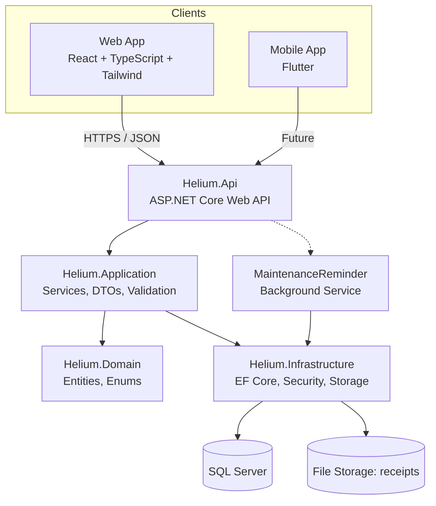
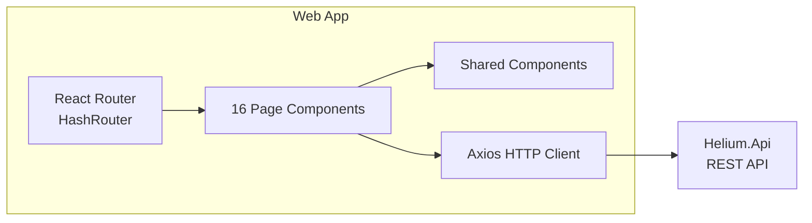

# Architecture and Other Details

> **Helium App** — full-stack vehicle management application for tracking fuel/charging entries, maintenance records, and fleet analytics. Built with ASP.NET Core, React, TypeScript, and Tailwind CSS.
>
> This document is the single source of truth for system architecture, API reference, business logic, and development setup.

---

## Part 1 — System Architecture

### High-Level Architecture



### Layer Breakdown

#### 1. Helium.Domain (Core)
The innermost layer with zero dependencies.

| Component | Contents |
|-----------|----------|
| Entities | `User`, `Vehicle`, `FuelEntry`, `ChargingEntry`, `MaintenanceRecord`, `MaintenanceReminder` |
| Enums | `PowertrainType` (Petrol/Diesel/Hybrid/Electric), `VehicleBodyType` (Car/Van/Bike/Truck/Suv), `ReminderIntervalType` (Mileage/Time) |
| Common | `EntityBase` — provides `Id`, `CreatedAt`, `UpdatedAt` to all entities |

#### 2. Helium.Application (Use Cases)
Orchestrates business logic. Depends only on Domain.

| Component | Contents |
|-----------|----------|
| Interfaces | `IVehicleService`, `IFuelEntryService`, `IChargingEntryService`, `IMaintenanceService`, `IAuthService`, `IReportService`, `IDashboardService` |
| DTOs (Models) | Create/Update/Read DTOs for every entity + pagination models (`PaginationQuery`, `PagedResult<T>`, `SortDirection`) |
| Services | Full CRUD implementations + efficiency reports + dashboard summaries + yearly energy trends |
| Validation | FluentValidation validators for auth, vehicle, fuel/charging, maintenance |
| Mapping | AutoMapper profile (`ApplicationMappingProfile`) for entity-to-DTO mapping |

#### 3. Helium.Infrastructure (Persistence & External Concerns)
Implements interfaces defined in Application. Depends on Application + Domain.

| Component | Contents |
|-----------|----------|
| Persistence | EF Core `AppDbContext`, `GenericRepository<T>`, `UnitOfWork`, EF Migrations |
| Security | `PasswordHasher` (SHA256 + salt), `JwtTokenService` (HMAC-SHA256), `JwtSettings` |
| Storage | `LocalFileStorageService` — save/get/delete receipt images on disk |
| Notifications | `NotificationService` — currently a logger placeholder |
| DI | `DependencyInjection` class for registering all infrastructure services |

#### 4. Helium.Api (Presentation)
ASP.NET Core Web API. Depends on Application + Infrastructure.

| Component | Contents |
|-----------|----------|
| Controllers | `AuthController`, `VehiclesController`, `FuelEntriesController`, `ChargingEntriesController`, `MaintenanceRecordsController`, `ReportsController`, `DashboardController`, `FilesController`, `UsersController` |
| Middleware | Global `ExceptionHandlingMiddleware` (404/401/400/500 mapping) |
| Background Services | `MaintenanceReminderBackgroundService` (runs every 6 hours) |
| Configuration | `appsettings.json` — connection string, JWT settings, Serilog |

### Frontend Architecture



**Web App (React 17 + TypeScript + Tailwind CSS)**
- **Routing**: React Router v5 with `HashRouter` — 14 routes (dashboard, vehicles, fuel/charging/maintenance entries, login, signup)
- **State**: Local component state (no Redux/Zustand)
- **Styling**: Tailwind CSS exclusively (Bootstrap removed)
- **Layout**: Collapsible sidebar (expand/collapse toggle), sticky viewport-locked navigation, scrollable main content area
- **Branding**: Vehicle-themed SVG favicon (`web/public/favicon.svg` — blue badge with car silhouette + speedometer arc) referenced from `public/index.html`; shown as the browser tab icon
- **Dashboard Sections**: Action buttons, efficiency cards (km/L & km/kWh per vehicle), price per liter trend chart (with hover tooltips), cost overview line chart, fleet snapshot table, maintenance outlook, recent activity feed

**Mobile App (Flutter)**
- Scaffolded only — Android + iOS project files, `pubspec.yaml`, no application code yet
- Planned to consume same REST API

### Data Flow

```
User Action → React Page → Axios (JWT) → Helium.Api Controller
  → Application Service → Repository → EF Core → SQL Server
  → Response ← DTO ← Entity ←
```

### Tech Stack

| Layer | Technology | Version |
|-------|------------|---------|
| Backend Framework | ASP.NET Core | 10.0 |
| ORM | Entity Framework Core | 10.x |
| Database | SQL Server Express | localhost\SQLEXPRESS |
| Auth | JWT (HMAC-SHA256) | Custom |
| Validation | FluentValidation | Latest |
| Mapping | AutoMapper | Latest |
| Logging | Serilog | Latest |
| Web Frontend | React | 17 |
| Web Language | TypeScript | 4.x |
| Styling | Tailwind CSS | 4.x |
| HTTP Client | Axios | 1.x |
| Mobile Frontend | Flutter | Latest (scaffolded) |

---

## Part 2 — Business Logic Reference

Every business rule, calculation, formula, and validation across the backend.

### 2.1 Entity Business Rules

#### Vehicle

| Rule | Detail |
|------|--------|
| Ownership | Every vehicle belongs to a `User` via `UserId` FK |
| Name | Required, max 100 chars |
| Make | Required, max 100 chars |
| Model | Required, max 100 chars |
| Year | Optional; if provided, 1900 ≤ Year ≤ (current year + 1) |
| VIN | Optional, max 50 chars |
| PowertrainType | `Petrol=0, Diesel=1, Hybrid=2, Electric=3` |
| BodyType | Enum (`Sedan, SUV, Truck, Hatchback, Coupe, Wagon, Van, Convertible`) |

**Powertrain Classification for calculations:**
- **ICE (Internal Combustion):** `Petrol` OR `Diesel`
- **Fuel-capable:** ICE + `Hybrid` (can receive fuel entries)
- **EV-capable:** `Hybrid` OR `Electric` (can receive charging entries)

#### FuelEntry

| Rule | Detail |
|------|--------|
| Ownership | Belongs to `User` and `Vehicle` via FK |
| Date | Required (`DateOnly`) |
| OdometerReadingKm | Required, ≥ 0 |
| Liters | Required, > 0 |
| Cost | Required, ≥ 0, stored as `decimal(18,2)` |
| FuelStationName | Optional, max 200 chars |
| User FK | `DeleteBehavior.NoAction` (prevents cascade cycle) |

#### ChargingEntry

| Rule | Detail |
|------|--------|
| Ownership | Belongs to `User` and `Vehicle` via FK |
| Date | Required (`DateOnly`) |
| OdometerReadingKm | Required, ≥ 0 |
| KwhUsed | Required, > 0, stored as `decimal(18,2)` |
| Cost | Required, ≥ 0, stored as `decimal(18,2)` |
| ChargingLocation | Optional, max 200 chars |
| Vehicle eligibility | Only `Hybrid` or `Electric` vehicles accept charging entries |
| User FK | `DeleteBehavior.NoAction` |

#### MaintenanceRecord

| Rule | Detail |
|------|--------|
| Ownership | Belongs to `User` and `Vehicle` via FK |
| MaintenanceType | Required, max 200 chars |
| OdometerReadingKm | Required, ≥ 0 |
| ServiceDate | Required (`DateOnly`) |
| Cost | Required, ≥ 0, stored as `decimal(18,2)` |
| WorkStatus | Enum: `Scheduled=0, InProgress=1, Completed=2`; default `Scheduled` |
| GarageName | Optional, max 200 chars |
| MechanicName | Optional, max 200 chars |
| User FK | `DeleteBehavior.NoAction` |
| Reminder FK | `DeleteBehavior.Cascade` (delete reminders when record deleted) |

#### MaintenanceReminder

| Rule | Detail |
|------|--------|
| IntervalType | `Mileage=0` or `Time=1` |
| IntervalValue | Positive integer (days for Time, km for Mileage) |
| NextDueDate | Set if IntervalType == Time: `ServiceDate + IntervalValue days` |
| NextDueMileageKm | Set if IntervalType == Mileage: `OdometerReadingKm + IntervalValue km` |

#### User

| Rule | Detail |
|------|--------|
| Email | Required, max 200 chars, unique (case-insensitive) |
| FirstName | Required, max 100 chars |
| LastName | Required, max 100 chars |
| PreferredCurrency | Required, max 10 chars, default `"USD"` |
| Password | Self-hashed: SHA256(salt + password), salt = 16 random bytes |
| JWT | Contains `sub` (UserId), `email`; expires after 120 min; signed HMAC-SHA256 |

### 2.2 Authorization Rules

Every entry table (`FuelEntry`, `ChargingEntry`, `MaintenanceRecord`) has a direct `UserId` FK. All read/write operations filter by `userId` extracted from the JWT `sub` claim.

| Service | Create Check | Read/Update/Delete Check |
|---------|-------------|-------------------------|
| FuelEntryService | `vehicle.UserId == dto.UserId` | `entity.UserId == userId` |
| ChargingEntryService | `vehicle.UserId == dto.UserId` | `entity.UserId == userId` |
| MaintenanceService | `vehicle.UserId == dto.UserId` | `entity.UserId == userId` |
| VehicleService | Any authenticated user | `vehicle.UserId == userId` |

Unauthorized attempts throw `UnauthorizedAccessException` → mapped to HTTP 401.

### 2.3 Dashboard Calculations

#### Summary (`GetSummaryAsync`)

Returns `DashboardSummaryDto` with three sections:

**ICE Summary (`iceSummary`):**
- Vehicles: `PowertrainType == Petrol || Diesel`
- TotalCost: `Sum(FuelEntry.Cost)` for these vehicles in the current month
- TotalMileageKm: For each ICE vehicle, `max(Odometer) - min(Odometer)` from its fuel entries, summed across all vehicles

**EV Summary (`evSummary`):**
- Vehicles: `PowertrainType == Hybrid || Electric`
- Cost/Mileage calculated from `ChargingEntry` entries (same formula as ICE)
- Note: Uses charging entries, not fuel entries

**Maintenance Summary (`maintenanceSummary`):**
- `DueThisMonth`: Count of reminders where `NextDueDate <= today`
- `RemainingThisMonth`: Count where `today < NextDueDate <= monthEnd`
- `TotalCost`: `Sum(MaintenanceRecord.Cost)` for the month

#### Vehicle Summaries (`GetVehicleSummariesAsync`)

Per-vehicle snapshot for the Fleet Snapshot table:

**Current Odometer:**
```
currentOdometer = max(
    max(MaintenanceRecords.Odometer),
    max(FuelEntries.Odometer),
    max(ChargingEntries.Odometer)
)
```

**Monthly Costs (per vehicle):**

| Cost Field | Source | Filter |
|------------|--------|--------|
| `monthlyFuelCost` | `FuelEntry.Cost` | `VehicleId == vehicle.Id && Date in [monthStart, monthEnd]` |
| `monthlyChargingCost` | `ChargingEntry.Cost` | `VehicleId == vehicle.Id && Date in [monthStart, monthEnd]` |
| `monthlyMaintenanceCost` | `MaintenanceRecord.Cost` | `VehicleId == vehicle.Id && ServiceDate in [monthStart, monthEnd]` |
| `monthlyCost` (total) | Sum of the three above | — |

**Next Maintenance:**
- Finds the earliest upcoming reminder where `WorkStatus != Completed`
- If `NextDueDate.HasValue` → show date
- If `NextDueMileageKm.HasValue` → show formatted km

#### Energy Trend (`GetYearlyEnergyTrendAsync`)

Returns monthly aggregated data for line/trend charts.

**Input:** Year, optional VehicleId (per-vehicle filter)

**Per-month aggregation:**

| Field | Formula |
|-------|---------|
| `fuelCost` | `Sum(FuelEntry.Cost)` where month matches |
| `chargingCost` | `Sum(ChargingEntry.Cost)` where month matches |
| `fuelVolumeLiters` | `Sum(FuelEntry.Liters)` |
| `energyConsumedKwh` | `Sum(ChargingEntry.KwhUsed)` |
| `maintenanceCost` | `Sum(MaintenanceRecord.Cost)` where month matches |

**Derived fields in `EnergyTrendPointDto`:**
```csharp
TotalCost      = FuelCost + ChargingCost
TotalUsage     = FuelVolumeLiters + EnergyConsumedKwh
GrandTotalCost = FuelCost + ChargingCost + MaintenanceCost
```

**Used by frontend for:**
- **Cost Overview line chart**: Shows `fuelCost`, `chargingCost`, `maintenanceCost` as 3 separate lines
- **Price per Liter trend**: Shows `fuelCost / fuelVolumeLiters` per month (line chart with hover tooltips)

#### Recent Activity (`GetRecentActivityAsync`)

**Activity type mapping:**

| Source | ActivityType | Description Format |
|--------|-------------|-------------------|
| FuelEntry | `"Fuel"` | `"Filled {Liters:N1}L at {StationName}"` |
| ChargingEntry | `"Charging"` | `"Charged {KwhUsed:N1}kWh at {Location}"` |
| MaintenanceRecord | `"Maintenance"` | `"{MaintenanceType} ({WorkStatus})"` |

**Sorting:** By `ActivityDate` descending, top 10.

#### Available Years (`GetAvailableYearsAsync`)

Collects distinct years from `FuelEntry.Date`, `ChargingEntry.Date`, and `MaintenanceRecord.ServiceDate`. Always includes current year. Returns sorted descending.

### 2.4 Fuel Efficiency Calculation

**Formula (Per-Fill-Up Average):**

```csharp
// For each consecutive pair of fuel entries:
for (int i = 1; i < entries.Count; i++) {
    tripDist  = entries[i].Odometer - entries[i-1].Odometer;  // km driven
    tripLiters = entries[i].Liters;                            // liters added
    if (tripDist > 0 && tripLiters > 0)
        kmPerLiter = tripDist / tripLiters;  // this fill-up's efficiency
}
// Display: average of all per-fill-up km/L values
```

- **km/kWh (electric efficiency):** Same per-charge-pair average approach.
- **Cost/km:** `costPerKm = totalCost / totalDistance`
- **Requires ≥ 2 entries** with different odometer readings; each consecutive pair produces one trip measurement.
- **Hybrid handling:** Fuel distance uses only fuel entry odometer pairs; electric distance uses only charging pairs — prevents inflated efficiency where battery-assisted km are attributed to fuel.

### 2.5 Maintenance Reminder Logic

| Interval Type | Next Due Calculation |
|---------------|---------------------|
| `Time` | `NextDueDate = ServiceDate.AddDays(IntervalValue)`; `NextDueMileageKm = null` |
| `Mileage` | `NextDueMileageKm = OdometerReadingKm + IntervalValue`; `NextDueDate = null` |

**Due Check (`GetDueRemindersAsync`):**

| Check | Condition |
|-------|-----------|
| Due by Date | `IntervalType == Time && NextDueDate <= asOfDate` |
| Due by Mileage | `IntervalType == Mileage && latestOdometer >= NextDueMileageKm` |

Where `latestOdometer` is the max odometer from Fuel, Charging, and Maintenance entries for the vehicle.

**Background Service:** Runs every 6 hours, checks ALL users (`userId = null`).

### 2.6 Validation Rules

#### Vehicle

| Field | Rule | Create | Update |
|-------|------|:------:|:------:|
| Name | NotEmpty, MaxLength(100) | ✓ | ✓ |
| Make | NotEmpty, MaxLength(100) | ✓ | ✓ |
| Model | NotEmpty, MaxLength(100) | ✓ | ✓ |
| Year | InclusiveBetween(1900, currentYear+1) when set | ✓ | ✓ |
| BodyType | IsInEnum | ✓ | — |
| PowertrainType | IsInEnum | ✓ | — |

#### FuelEntry

| Field | Rule | Create | Update |
|-------|------|:------:|:------:|
| VehicleId | NotEmpty | ✓ | — |
| Date | NotEmpty | ✓ | ✓ |
| OdometerReadingKm | GreaterThanOrEqualTo(0) | ✓ | ✓ |
| Liters | GreaterThan(0) | ✓ | ✓ |
| Cost | GreaterThanOrEqualTo(0) | ✓ | ✓ |
| FuelStationName | MaxLength(200) | ✓ | ✓ |

#### ChargingEntry

| Field | Rule | Create | Update |
|-------|------|:------:|:------:|
| VehicleId | NotEmpty | ✓ | — |
| Date | NotEmpty | ✓ | ✓ |
| OdometerReadingKm | GreaterThanOrEqualTo(0) | ✓ | ✓ |
| KwhUsed | GreaterThan(0) | ✓ | ✓ |
| Cost | GreaterThanOrEqualTo(0) | ✓ | ✓ |
| ChargingLocation | MaxLength(200) | ✓ | ✓ |

#### MaintenanceRecord

| Field | Rule | Create | Update |
|-------|------|:------:|:------:|
| VehicleId | NotEmpty | ✓ | — |
| MaintenanceType | NotEmpty, MaxLength(200) | ✓ | ✓ |
| OdometerReadingKm | GreaterThanOrEqualTo(0) | ✓ | ✓ |
| ServiceDate | NotEmpty | ✓ | ✓ |
| Cost | GreaterThanOrEqualTo(0) | ✓ | ✓ |
| GarageName | MaxLength(200) | ✓ | ✓ |
| MechanicName | MaxLength(200) | ✓ | ✓ |
| WorkStatus | IsInEnum | ✓ | ✓ |

#### Auth

| Register Field | Rule |
|----------------|------|
| FirstName | NotEmpty, MaxLength(100) |
| LastName | NotEmpty, MaxLength(100) |
| Email | NotEmpty, EmailAddress, MaxLength(200) |
| Password | NotEmpty, MinimumLength(6) |
| PreferredCurrency | NotEmpty, MaxLength(10) |

| Login Field | Rule |
|-------------|------|
| Email | NotEmpty, EmailAddress, MaxLength(200) |
| Password | NotEmpty, MinimumLength(6) |

### 2.7 Exception to HTTP Status Mapping

| Exception | HTTP Status |
|-----------|-------------|
| `KeyNotFoundException` | 404 Not Found |
| `UnauthorizedAccessException` | 401 Unauthorized |
| `InvalidOperationException` | 400 Bad Request |
| Validation failures | 400 Bad Request (FluentValidation) |
| All other exceptions | 500 Internal Server Error |

### 2.8 Database Constraints

- **Decimal Precision:** `FuelEntry.Cost/Liters`, `ChargingEntry.Cost/KwhUsed`, `MaintenanceRecord.Cost` → `decimal(18,2)`
- **FK Cascade Rules:** User → Entry tables: `DeleteBehavior.NoAction`; MaintenanceRecord → MaintenanceReminder: `DeleteBehavior.Cascade`
- **Indexes:** `User.Email` — unique index

### 2.9 Auth & Security

**Password Hashing**
```
salt = RandomBytes(16)       // Base64-encoded
hash = SHA256(salt + password) // Base64-encoded
```

**JWT Token**
```
Claims: sub (UserId), email, nameid
Algorithm: HmacSha256
Expires: DateTime.UtcNow + 120 minutes
```

**Registration**
1. Check email uniqueness (case-insensitive)
2. Hash password with salt
3. Create User with new GUID
4. Return JWT token

**Login**
1. Find user by email (case-insensitive)
2. Hash input password with stored salt
3. Compare hash with stored hash
4. Return JWT token on match; throw `UnauthorizedAccessException` on mismatch

**Planned: PIN-Based Passwordless Login (ADR-015 in Context Ledger.md)**

> Design approved, not yet implemented. Will replace registration/login above.

1. `POST /api/auth/send-pin` — generate 6-digit PIN, store in `IMemoryCache` (`pin:{email}`, 5-min expiry), email via Gmail SMTP (MailKit); dev mode logs PIN to console instead
2. `POST /api/auth/verify-pin` — validate PIN against cache; auto-create user if email is new; return JWT + user
3. First-time users complete profile via `PATCH /api/users/me` on an `/onboarding` page (first/last name required; address, mobile optional) before reaching the dashboard

### 2.10 Dashboard Frontend Features

| Section | Location | Data Source |
|---------|----------|-------------|
| **Action Buttons** | Top | Navigation links |
| **Efficiency Cards** | Below actions | Per-vehicle km/L & km/kWh from `GetVehicleSummariesAsync` |
| **Price per Liter Trend** | Below efficiency | `GetYearlyEnergyTrendAsync` → `fuelCost / fuelVolumeLiters` |
| **Cost Overview Line Chart** | Below price trend | `GetYearlyEnergyTrendAsync` — 3 lines (fuel/charging/maintenance) |
| **Fleet Snapshot** | Side-by-side with Maintenance | Vehicle summary table with Fuel/Charging/Maintenance cost columns |
| **Maintenance Outlook** | Side-by-side with Fleet | Due/remaining reminders + spend + quick tips |
| **Recent Activity** | Bottom | Latest 10 fuel/charging/maintenance entries |

**Sidebar**
- Collapsible: toggle between full `w-64` and minimal `w-14`
- Navigation: Overview, Vehicles, Fuel Entries, Charging Entries, Maintenance
- Footer: User name + red Logout button
- `h-screen overflow-hidden` on parent keeps sidebar fixed to viewport

---

## Part 3 — REST API Reference

Base URL: `http://localhost:10011` (default)
**All URLs are lowercase** due to `LowercaseUrls = true` in the backend config.

### Authentication

#### POST /api/auth/register
Create a new user account. **Auth:** None

```json
{
  "firstName": "John",
  "lastName": "Doe",
  "email": "john@example.com",
  "password": "Str0ng!Pass",
  "preferredCurrency": "USD"
}
```

Password rules: min 6 chars. **Response:** `200 OK` — returns JWT token string.

#### POST /api/auth/login
Authenticate and receive a JWT token. **Auth:** None

```json
{
  "email": "john@example.com",
  "password": "Str0ng!Pass"
}
```

**Response:** `200 OK` — returns JWT token string.

### Users

Requires `Authorization: Bearer <token>`.

#### GET /api/users/me
Get the currently authenticated user's profile. **Response:** `200 OK`

```json
{
  "id": "guid",
  "firstName": "John",
  "lastName": "Doe",
  "email": "john@example.com",
  "preferredCurrency": "USD"
}
```

### Health

#### GET /api/health
Health check endpoint. **Auth:** None. **Response:** `200 OK` — `{ "status": "ok" }`

### Vehicles

All vehicle endpoints require `Authorization: Bearer <token>`.

#### GET /api/vehicles
List vehicles for the authenticated user.
**Query Parameters:** `page` (int), `pageSize` (int), `sortBy` (Name/CreatedAt), `sortDirection` (Asc/Desc)
**Response:** `200 OK` — `PagedResult<VehicleDto>`

#### GET /api/vehicles/{id}
Get a single vehicle. **Response:** `200 OK` — `VehicleDto`

#### POST /api/vehicles
Create a new vehicle.

```json
{
  "name": "My Car",
  "make": "Toyota",
  "model": "Camry",
  "year": 2022,
  "powertrainType": 0,
  "bodyType": 0,
  "vin": "1HGCM82633A004352"
}
```

**PowertrainType:** Petrol=0, Diesel=1, Hybrid=2, Electric=3
**BodyType:** Sedan=0, SUV=1, Truck=2, Hatchback=3, Coupe=4, Wagon=5, Van=6, Convertible=7

**Response:** `201 Created`

#### PUT /api/vehicles/{id}
Update an existing vehicle. **Response:** `200 OK`

#### DELETE /api/vehicles/{id}
Delete a vehicle. **Response:** `204 No Content`

### Fuel Entries

All fuel entry endpoints require `Authorization: Bearer <token>`.

#### GET /api/fuelentries
List fuel entries.
**Query Parameters:** `vehicleId` (guid, optional filter), `page`, `pageSize`, `sortBy` (Date/Odometer), `sortDirection`
**Response:** `200 OK` — `PagedResult<FuelEntryDto>`

#### GET /api/fuelentries/{id}
Get a single fuel entry. **Response:** `200 OK` — `FuelEntryDto`

#### POST /api/fuelentries
Create a fuel entry.

```json
{
  "vehicleId": "guid",
  "date": "2024-01-15",
  "odometerReadingKm": 50000,
  "liters": 45.5,
  "cost": 85.00,
  "fuelStationName": "Shell",
  "receiptImagePath": "receipts/abc.jpg"
}
```

**Response:** `201 Created`

#### PUT /api/fuelentries/{id}
Update a fuel entry. **Response:** `200 OK`

#### DELETE /api/fuelentries/{id}
Delete a fuel entry. **Response:** `204 No Content`

### Charging Entries

All charging entry endpoints require `Authorization: Bearer <token>`.

#### GET /api/chargingentries
List charging entries.
**Query Parameters:** `vehicleId` (guid, optional filter), `page`, `pageSize`, `sortBy` (Date/Odometer), `sortDirection`
**Response:** `200 OK` — `PagedResult<ChargingEntryDto>`

#### GET /api/chargingentries/{id}
Get a single charging entry. **Response:** `200 OK` — `ChargingEntryDto`

#### POST /api/chargingentries
Create a charging entry.

```json
{
  "vehicleId": "guid",
  "date": "2024-01-15",
  "odometerReadingKm": 50000,
  "kwhUsed": 35.2,
  "cost": 12.50,
  "chargingLocation": "ChargePoint - Downtown"
}
```

**Vehicle eligibility:** Only `Hybrid` or `Electric` vehicles accept charging entries.
**Response:** `201 Created`

#### PUT /api/chargingentries/{id}
Update a charging entry. **Response:** `200 OK`

#### DELETE /api/chargingentries/{id}
Delete a charging entry. **Response:** `204 No Content`

### Maintenance Records

All maintenance record endpoints require `Authorization: Bearer <token>`.

#### GET /api/maintenancerecords
List maintenance records.
**Query Parameters:** `vehicleId` (guid, optional filter), `page`, `pageSize`, `sortBy` (Date/Odometer), `sortDirection`
**Response:** `200 OK` — `PagedResult<MaintenanceRecordDto>`

#### GET /api/maintenancerecords/due
Get maintenance records that are due for service.
**Query Parameters:** `asOfDate` (date string, optional)
**Response:** `200 OK` — list of due maintenance records

#### GET /api/maintenancerecords/{id}
Get a single maintenance record. **Response:** `200 OK` — `MaintenanceRecordDto`

#### POST /api/maintenancerecords
Create a maintenance record with optional reminder.

```json
{
  "vehicleId": "guid",
  "maintenanceType": "Oil Change",
  "odometerReadingKm": 50000,
  "serviceDate": "2024-06-01",
  "cost": 85.00,
  "garageName": "AutoCare Center",
  "mechanicName": "Mike",
  "workStatus": 0,
  "notes": "Full synthetic",
  "receiptImagePath": "receipts/oil.jpg",
  "reminder": {
    "intervalType": 1,
    "intervalValue": 180,
    "nextDueDate": "2024-11-28",
    "nextDueMileageKm": null
  }
}
```

**WorkStatus:** Scheduled=0, InProgress=1, Completed=2
**ReminderIntervalType:** Mileage=0, Time=1

**Response:** `201 Created`

#### PUT /api/maintenancerecords/{id}
Update a maintenance record. **Response:** `200 OK`

#### DELETE /api/maintenancerecords/{id}
Delete a maintenance record. **Response:** `204 No Content`

### Dashboard

Requires `Authorization: Bearer <token>`.

#### GET /api/dashboard/summary
Get monthly dashboard summary.
**Query Parameters:** `month` (date string, optional — defaults to current month)
**Response:** `200 OK` — dashboard summary with vehicle count, ICE/EV spend, maintenance due count

#### GET /api/dashboard/energy-trend
Get yearly energy cost/usage trend.
**Query Parameters:** `year` (int, optional — defaults to current year), `vehicleId` (guid, optional — filter to one vehicle)
**Response:** `200 OK` — 12-month breakdown including `fuelCost`, `chargingCost`, `fuelVolumeLiters`, `energyConsumedKwh`, `maintenanceCost`, `totalCost`, `totalUsage`, `grandTotalCost`

#### GET /api/dashboard/vehicles
Get per-vehicle summary with efficiency metrics.
**Query Parameters:** `month` (date string, optional — defaults to current month)
**Response:** `200 OK` — list of vehicle summaries including `monthlyFuelCost`, `monthlyChargingCost`, `monthlyMaintenanceCost`, `kmPerLiter`, `kmPerKwh`, `costPerKm`

#### GET /api/dashboard/recent-activity
Get latest entries across all vehicles.
**Query Parameters:** `count` (int, optional — defaults to 10)
**Response:** `200 OK` — list of `RecentActivityDto` (fuel/charging/maintenance)

#### GET /api/dashboard/available-years
Get distinct years with data. **Response:** `200 OK` — list of years (ints), sorted descending

### Reports

Requires `Authorization: Bearer <token>`.

#### GET /api/reports/vehicle-efficiency/{vehicleId}
Get efficiency report for a specific vehicle. **Response:** `200 OK`

```json
{
  "vehicleId": "guid",
  "kmPerLiter": 15.2,
  "kmPerKwh": null,
  "costPerKm": 0.08
}
```

- `kmPerLiter`: Per-fill-up average (fuel-capable vehicles only, ≥2 entries required)
- `kmPerKwh`: Per-charge-pair average (EV-capable vehicles only, ≥2 entries required)
- `costPerKm`: Lifetime total cost / total distance

### Files

Requires `Authorization: Bearer <token>`.

#### POST /api/files/receipts
Upload a receipt image. **Max file size:** 10 MB
**Request:** `multipart/form-data` with file field
**Response:** `200 OK` — `{ "path": "receipts/guid-filename.jpg" }`

### Error Responses

All endpoints return consistent error responses via the global exception middleware:

| Status | Condition |
|--------|-----------|
| 400 | Invalid operation / validation failure |
| 401 | Unauthorized / missing/invalid JWT |
| 404 | Resource not found |
| 500 | Unexpected server error |

---

## Part 4 — Development Setup

### Prerequisites

| Tool | Version | Purpose |
|------|---------|---------|
| [.NET SDK](https://dotnet.microsoft.com/download) | 10.0+ | Backend API |
| [Node.js](https://nodejs.org/) | 14+ | Frontend web app |
| [npm](https://www.npmjs.com/) | 8+ | Package management |
| [SQL Server LocalDB](https://learn.microsoft.com/en-us/sql/database-engine/configure-windows/sql-server-express-localdb) | 2019+ | Local database (ships with Visual Studio) |
| [Flutter](https://flutter.dev/docs/get-started/install) | Latest | Mobile app (optional) |

### 1. Clone the Repository

```bash
git clone <repository-url>
cd "Helium App"
```

### 2. Configure the Backend

**Database Connection** — `Backend/Helium.Api/appsettings.json`:

```json
{
  "ConnectionStrings": {
    "HeliumCoreConnection": "Server=localhost\\SQLEXPRESS;Database=helium_maindb;Trusted_Connection=True;TrustServerCertificate=True;MultipleActiveResultSets=true"
  }
}
```

The default uses SQL Server Express (`localhost\SQLEXPRESS`). For production, use User Secrets to avoid committing credentials.

**JWT Secret** — same file:

```json
{
  "Jwt": {
    "Issuer": "HeliumApp",
    "Audience": "HeliumAppUsers",
    "Secret": "YOUR_32_CHAR_OR_LONGER_SECRET_KEY",
    "ExpiresMinutes": 120
  }
}
```

**Important:** The secret should be at least 32 characters long. Never commit a real secret to version control.

**Run Database Migrations** — applied automatically on startup. Manual alternative:

```bash
cd Backend
dotnet ef database update --project Helium.Infrastructure --startup-project Helium.Api
```

**Run the Backend:**

```bash
cd Backend
dotnet run --project Helium.Api/Helium.Api.csproj
```

The API starts on:
- `http://localhost:10011`
- `https://localhost:10012`

To verify: visit `http://localhost:10011/api/health` — should return `{"status":"ok"}`.

### 3. Configure the Web Frontend

**Install Dependencies:**

```bash
cd "Frontend/helium-frontend/web"
npm install
```

**Configure Backend URL** — edit `public/appsettings.json`:

```json
{
  "apiBaseUrl": "http://localhost:10011"
}
```

Match the URL where the backend is running.

**Run the Web App:**

```bash
npm start
```

Opens at `http://localhost:10015`.

### 4. One-Click Launcher (AutoHotkey)

`start-helium.ahk` (repo root) starts the stack interactively:

- **Yes** → Backend (`dotnet run --project Helium.Api`) + Frontend (`npm start`), then opens `http://localhost:10015`
- **No** → Frontend only

Requires [AutoHotkey v2](https://www.autohotkey.com/). Double-click to run, or copy it into the Windows Startup folder (`shell:startup`) to launch automatically at login.

### 5. Mobile App (Flutter)

The Flutter project is scaffolded but has no application code yet.

```bash
cd "Frontend/helium-frontend/mobile"
flutter pub get
flutter run   # Requires an emulator or physical device
```

### 6. Verify Everything Works

1. Backend is running → `http://localhost:10011/api/health` returns ok
2. Frontend is running → `http://localhost:10015` loads
3. Create an account via the Signup page
4. Log in → redirected to Dashboard
5. Add a vehicle → appears in Vehicles list
6. Add fuel/charging/maintenance entries → appear in their respective lists
7. Dashboard shows summary stats

### Common Issues

| Issue | Fix |
|-------|-----|
| "Could not find database" / Login failed | Ensure SQL Server LocalDB is installed: run `SqlLocalDB info`. If missing, install via Visual Studio Installer ("SQL Server Express LocalDB" workload) |
| CORS error in browser | Ensure backend URL in `public/appsettings.json` matches exactly (including port). Backend CORS allows `http://localhost:10015` only |
| JWT token expired | Tokens expire after 120 minutes (configurable). Log out/in for a new token. No refresh mechanism currently |
| `dotnet build` fails | Ensure .NET 10 SDK: `dotnet --version`. Restore packages: `dotnet restore` |
| `npm start` fails | Ensure Node.js 14+: `node --version`. Delete `node_modules` and reinstall. If OpenSSL errors, the start script already includes `NODE_OPTIONS=--openssl-legacy-provider` |

### Useful Commands

```bash
# Backend
dotnet build                           # Build the backend
dotnet run --project Helium.Api        # Run the API
dotnet test                            # Run tests
dotnet ef migrations add MigrationName # Create a new migration

# Frontend
npm start                              # Start dev server
npm run build                          # Production build
npm test                               # Run frontend tests
```

---

## Part 5 — Project Structure

```
Helium App/
├── Backend/                     # ASP.NET Core Web API (Clean Architecture)
│   ├── Helium.Domain/           #   Entities, Enums, Common base classes
│   ├── Helium.Application/      #   DTOs, Services, Validation, Mapping
│   ├── Helium.Infrastructure/   #   EF Core, Repositories, Security, Storage
│   ├── Helium.Api/              #   Controllers, Middleware, Background Services
│   └── Helium.Api.Tests/        #   Test project
├── Frontend/
│   └── helium-frontend/
│       ├── web/                 # React + TypeScript + Tailwind CSS web app
│       └── mobile/              # Flutter mobile app (scaffolded)
├── start-helium.ahk             # AutoHotkey launcher (backend + frontend, prompts on start)
└── docs/                        # Project documentation
    ├── Architecture and Other Details.md   (this file)
    └── Context Ledger.md                   (decisions, roadmap, session history)
```

---

*Last updated: 2026-08-23*
